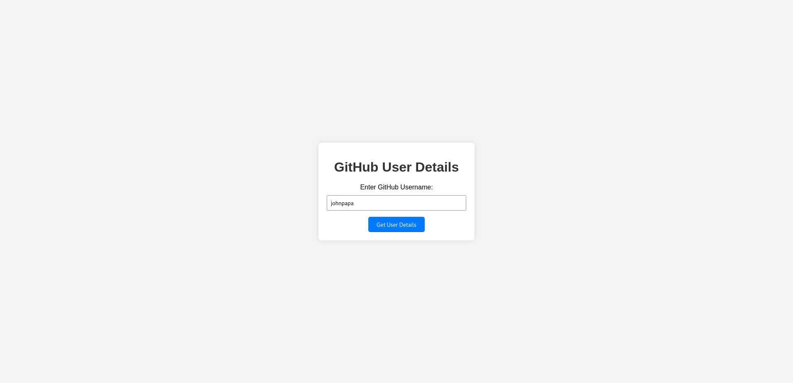
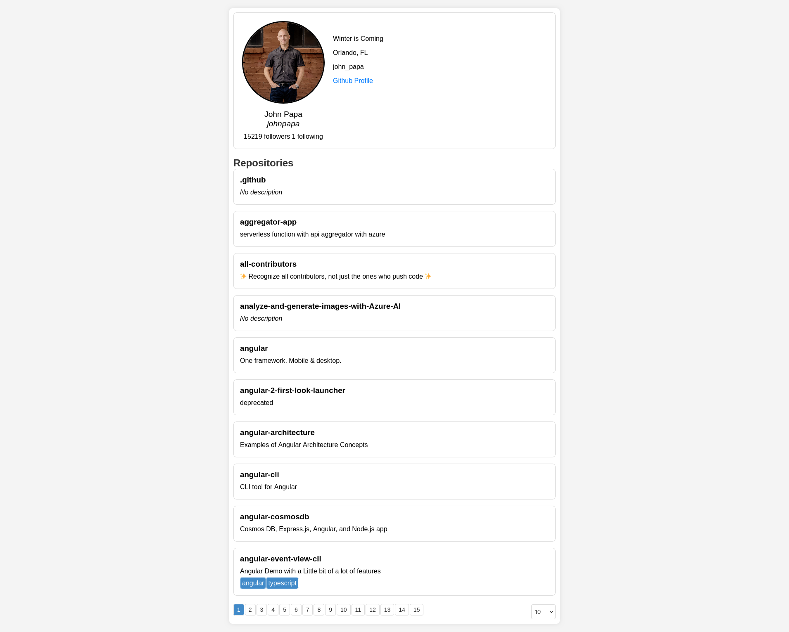

# GitHub User Repositories Viewer

## Overview

This web application allows users to view repositories of a GitHub user. It provides a simple and responsive interface to navigate through the user's repositories, with options for pagination and setting the number of repositories per page.




## Features

- Display user details, including basic information and repositories.
- Paginate through repositories with next and previous buttons.
- Select the number of repositories to display per page.
- Include a dynamic loader to indicate the API request status, ensuring a seamless user experience.

## Getting Started

### Prerequisites

- Ensure you have a modern web browser installed (Chrome, Firefox, Safari, etc.).
- A live server is also needed to serve the static site. You can use tools like [Live Server](https://marketplace.visualstudio.com/items?itemName=ritwickdey.LiveServer) in Visual Studio Code or [SimpleHTTPServer](https://docs.python.org/3/library/http.server.html) in Python.

### Installation

1. Clone the repository to your local machine.

   ```bash
   https://github.com/aslezar/fyle-github-assignment
   ```

2. Open the project folder in your preferred code editor.

3. Start thr Live Server

### Usage

- Enter a GitHub username in the input box provided.

- Explore the user details and repositories.

- Use pagination buttons to navigate through repositories.

- Adjust the number of repositories per page using the dropdown.

### License

This project is licensed under the MIT License.
Acknowledgments

    Thanks to GitHub for providing the GitHub API that powers this application.
